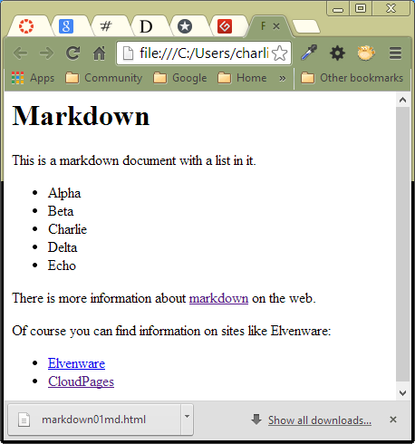
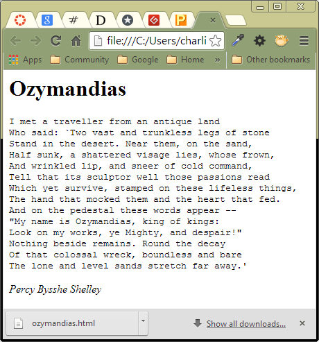

Week 2 Markdown Assignment
====================

This assignment is still being created, but here is enough information to get your started.

## Install Remarkable

Remarkable is a Markdown editor. It may already be installed on Pristine Lubuntu. If not, download it:

- [https://remarkableapp.github.io/linux/download.html](https://remarkableapp.github.io/linux/download.html)

Download the free deb file. After downloading it, click on it to launch it in the **Package Installer**. Select the install button. 

Once the install is complete, Remarkable should appear as an item in your **Accessories** menu.

## Using Markdown

Markdown is a mark up language for creating documents. It is a tool for creating 
richly formatted documents with a simple easy to use syntax. For instance, if 
you underline some text, or place to hash marks in front of it, then that marks it as an H1 header:

~~~~
# Markdown
~~~~

There are many other ways to mark up a document with markdown. You can also translate markdown to HTML.

When shown in the right renderer, the text shown above would appear in large bold font:

My Header
=========

Here is a longer example:

~~~~
Markdown
========

This is a markdown document with a list in it.

- Alpha
- Beta
- Charlie
- Delta
- Echo

Learn More
----------

There is more information about [markdown](https://www.google.com/search?q=markdown) on the web.

Of course you can find information on sites like Elvenware:

- [Elvenware](http://www.elvenware.com)
- [CloudPages](http://elvenware.com/charlie/books/CloudNotes/CloudNotes.html)
~~~~

Here is the output created by this markdown code:

Markdown
========

This is a markdown document with a list in it.

- Alpha
- Beta
- Charlie
- Delta
- Echo

Learn More
----------

There is more information about [markdown](https://www.google.com/search?q=markdown) on the web.

Of course you can find information on sites like Elvenware:

- [Elvenware](http://www.elvenware.com)
- [CloudPages](http://elvenware.com/charlie/books/CloudNotes/CloudNotes.html)

There are many tools available that can convert the Markdown shown into HTML. If you 
feed one of those tools the original markdown shown near the top of this document, 
then it can produce HTML that looks like this:

If you take the HTML shown above, and save it to a file called Markdown01.html, 
then double click the file in the Windows Explorer, the file should automatically 
open in a browser. When rendered in a browser, the file looks like the screenshot 
shown below:

Take a moment to consider what we are doing. We are using an extremely simple form 
of markup to create nicely formatted HTML files that look reasonably attractive on 
the web. Markdown is flexible enough so that you can provide complex formatting for 
the HTML pages you render. For instance, much of Elvenware is now created with simple 
markdown files like the one shown above. Relatively complex tools, such as Stackoverflow, 
also use markdown as their primary source code format.

In this class we looking to find ways to create content of various kinds that can be shared 
between desktop machines, tablets, and phones. We are learning that we can create documents 
in Google Drive, in SkyDrive, on Google Sites, and on Evernote, and view them in all three 
places. We can also create markdown files and have them rendered in all three locations. 
In other words, this is another means of sharing information between multiple devices. As 
we will see, have information in simple text format like this provides special advantages 
that are hard to achieve with any of the other tools we have looked at so far.

Markdown Details
=================

So far we have looked at only three bits of markdown syntax. We have learned how to create:

- A level one header by putting a row of equal signs under our text
- A level two header by putting a row of dashes under our text
- A list by putting a dash in front of each item in the list

It can also be useful to tell markdown to leave the formatting for a text alone. For those of you who 
know HTML, this is similar to using the PRE tag. It can be helpful when you are trying to render code 
that has complex formatting, or when you are displaying poetry, that again has its own special formatting. 
We can render such text in several ways, but one of the simplest is by starting with a row of four 
tildas, then writing our formatting text. To mark the end of the formatted text, add another four 
tildas:

~~~~
	Ozymandias
	=========

	~~~~
	I met a traveller from an antique land
	Who said: `Two vast and trunkless legs of stone
	Stand in the desert. Near them, on the sand,
	Half sunk, a shattered visage lies, whose frown,
	And wrinkled lip, and sneer of cold command,
	Tell that its sculptor well those passions read
	Which yet survive, stamped on these lifeless things,
	The hand that mocked them and the heart that fed.
	And on the pedestal these words appear --
	"My name is Ozymandias, king of kings:
	Look on my works, ye Mighty, and despair!"
	Nothing beside remains. Round the decay
	Of that colossal wreck, boundless and bare
	The lone and level sands stretch far away.' 
	~~~~ 
~~~~
 
*Percy Bysshe Shelley*
 
The markdown shown above is rendered like this:

 
Notice that putting asterisks around the authors name caused it to be 
rendered in italics. Putting two asterisks would make the text appear 
in bold print.

Markdown on the Web
------------------

Go to one of these sites and see if you can get started creating your own Markdown document:

- [http://markable.in](http://markable.in)
- [http://daringfireball.net/projects/markdown/dingus](http://daringfireball.net/projects/markdown/dingus)
- [http://dillinger.io/](http://dillinger.io/)

Some of these sites show the HTML that can be derived from markdown. If you know anything 
at all about HTML, take a moment to study the HTML produced from your markdown.

The Assignment
-------------

I will create a Markdown assignment due by next Monday. Please check back here 
later in the week for more details. For now, just practice using Markdown in 
one of the online editors listed above.
