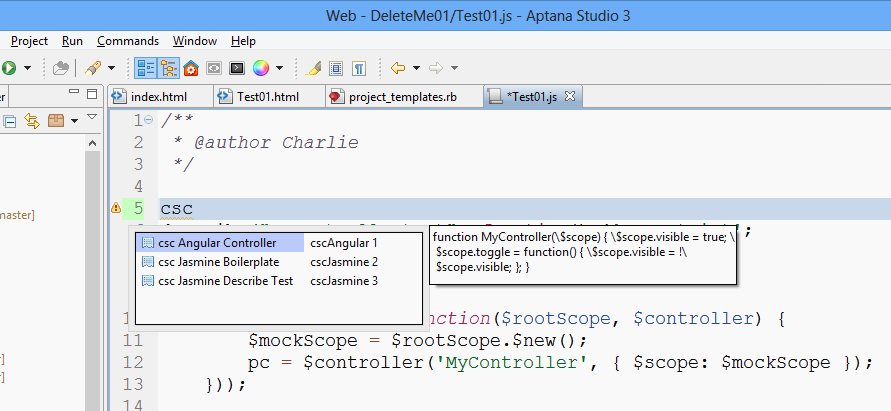

Week 04 Prog ISIT 320
=====================

- [Resources](Isit320-Resources.html)
- [Day 07 Deck](http://bit.ly/1gfEHFc)
- Pull from JSObjects and get the updates and new files from:
	- JsObjects/JavaScript/Design
- [Grunt on Elvenware](http://elvenware.com/charlie/development/web/UnitTests/Grunt.html)
- [Grunt jsHint](https://github.com/gruntjs/grunt-contrib-jshint)
- [Grunt Create Task](http://gruntjs.com/creating-tasks)
- [Aptana Eclipse Snippets](http://www.elvenware.com/charlie/development/android/Eclipse.html#snippets)

Optionally show the LoadJavaScript examples from:
	JsObjects/JavaScript/Syntax

Online
------

So far, there are three assignments to do over the weekend.

Assignment One: Project Templates
--------------------------------------

If you have not done so already, open up the HTML bundle in Aptana. 
There are two possible ways to do this. Pick the one that works on 
your system.

1. Commands | HTML | Edit this Bundle
2. Commands | Other | HTML | Edit this Bundle

It may take a moment, but eventually you should see a new folder
called HTML in your workspace.

Open the **templates** directory and find the file called 
**project_templates.rb**. Paste this code into the bottom of it:

```
project_template "Elvenware Angular Unit Test Project " do |t|
  t.type = :web
  t.tags = ['Web']
  t.icon = "templates/HTML5_Logo_64.png"
  t.id = "com.elvenware.project.template.web.html5"
  t.location = "git://github.com/charliecalvert/AngularTest.git"
  t.description = "Remote template. Requires network access."
  t.replace_parameters = false
  t.tags = ['Web']  
end
```

Restart Aptana. Select **File | New | Web Project**. Select the 
project called **Elvenware Angular Unit Test Project**. Create the
project as usually, filling in the name of the project. Run the 
two HTML files and confirm that they work.

Note that the template for the project is stored on GitHub, so you
have to be connected for this to work. That's a drawback, but there
are obvious benefits to pulling from a repository that I can easily
update.

Submit a screen shot of your Aptana IDE with the "Elvenware Angular
Unit Test Project" Template visiable. I want to see it in action,
showing that it pops up the right thing after you choose **File |
New | Web Project**.

You can use this as a template for any new Angular and Jasmine project
that you want to create.

Assignment Two: Snippets
------------------------

In JsObjects, go to the **Utilities | Eclipse Tools** folder. Grab
the two files you find there and copy them into the **snippets**
folder for the HTML bundle referenced in the previous assignment.
Restart the IDE.

Open up a JavaScript file in Aptana. In the editor for the JavaScript
file, type the letters **csc**. You should see at least three snippets
beginning with the letters CSC. Take a screen shot and submit that
screen shot.

- 

Assignment Three: Unit Tests
----------------------------

Start with the default project you learned how to create in 
Assignment 1 for this week. Modify the project so that you can:

- Convert Miles to Inches
- Convert Miles to Feet
- Convert Miles to Yards
- Convert Miles to Kilometers
- Convert Kilometers to Miles

Write a unit test for each method. 

When you are done, the user of index.html should be able to perform
each of the conversions. If we run Test01.html, we should be able
to confirm that each of the conversions work. You should create at
least a few unit tests that go after corner cases such as:

- The user enters 0
- The user enters a negative number
- The user enters a really, really big number

It doesn't matter so much how your program performs in each of those
cases, so long as your test defines how you expect the program to
behave. This is a way of defining the spec for your API.

Soon, perhaps next week. We will learn how to raise and handle 
exceptions if we get unexpected input.

When you are done, upload your project to repositority and send
me the URL. You can keep using your existing ISIT320 repository, and 
just put this assignment in a folder called **Week04-UnitTests**.

Assignment Four: Code Academy
-----------------------------

Provide a link to your Code Academy account showing that you have taken:

- Web Fundamentals to at least: 66%
- JavaScript to at least: 50%
- [Example](http://www.codecademy.com/netslayer43536)

Please put your picture in your Code Academy site, or link to your 
Google Site, or provide some other means of clearly linking yourself 
to the URL you provide.


