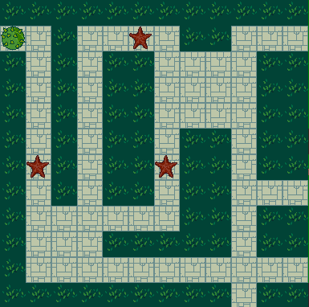

<!-- toc -->
<!-- tocstop -->

Canvas Grids
============

Create a 12 X 12 grid of 25 X 25 bitmap images displayed
in an HTML 5 canvas element. The user should be
able to use the up, left, right and down keys to
move a main character, represented by a second
bit map, around on the grid.

The canvas element should be 12 X 25 pixels
high, and 12 X 25 pixels wide.

Your program should include these files: 

* index.html
* index.js
* images.gif
* jquery-1.9.1.js

You should have a document ready handler at
the bottom of the JavaScript file. All the
rest of your code should be inside one 
object that follows the modular pattern
and is called Game.

Here is how to capture keydown events:

~~~~
	window.addEventListener('keydown', doKeyDown, true);
		
	var doKeyDown = function(evt) {
		switch (evt.keyCode) {
			case 38:
				/* Up arrow was pressed */
				break;
			case 40:
				/* Down arrow was pressed */
				break;
			case 37:
				/* Left arrow was pressed */
				break;
			case 39:
				/* Right arrow was pressed */
				break;
		}
	};
~~~~
	
When you are done, check your project into your Prog282-LastName folder, and 
make sure the folder is shared with me. My username on Bitbucket is 
ccalvert. When you turn in the assignment, include a link to your BitBucket 
home page or directly to your Prog282-LastName repository. 

Please include your last name in the title of your project. To do this, go to
the *.project* file included in the root of your project directory. (This is the
directory for your project, not for your repository.) The top of the *.project*
file should look something like this:

~~~~
	<?xml version="1.0" encoding="UTF-8"?>
	<projectDescription>
		<name>DataUsers Example01</name>
~~~~

Whatever you put in the name tag will be the name of your project 
when I open it in Eclipse. For instance, the name of the following project 
is *DrawGrid-Calvert*:

~~~~
	<?xml version="1.0" encoding="UTF-8"?>
	<projectDescription>
		<name>DrawGrid-Calvert</name>
~~~~

Eclipse seems to be a bit odd in the way it handles this name. If you import 
a fresh copy of the project into Eclipse, then Eclipse seems to get the name 
right. If you change the name of that string after loading the project in 
Eclipse, or if you try to change that string from inside Eclipse, then you 
don't always get the results you want. So you should make the change in a 
text editor outside of Eclipse, or at least confirm that the name in the 
*.project* file is what you expect it to be before checking in your final
version with Git. 

I added this requirement to set the name of the project rather late in the 
assignment cycle, so it is optional. But if you have not turned in the 
assignment yet, please make the change. It makes my life simpler if I know 
whose project is whose when I am looking at them inside Eclipse.

Strategies
----------

If you look in **JsObjects**, at example **JavaScript/Graphics/Basics05**, 
you will see that some of the drawing is done in the **draw** method:

~~~~
	var draw = function() {
		var count = 0;
		for (imageName in pictures) {
			context.drawImage(pictures[imageName], 0, rectSize, rectSize, 
				rectSize, rectSize * (count++ + 1), 135, rectSize, rectSize);
		}
	};
~~~~

As you recall, this method will be called at some predetermined interval, 
depending on how you set things up in the **getCanvas** method:

	setInterval(draw, 50);
	
The **draw** method is where you want to do most of your work. In 
particular, I would put the nested for loop in that method, and then I would 
add code for drawing the active character that glides over the surface of 
the grid. This means that the entire 12 X 12 grid, plus the main character, 
are being completely redrawn every 50 milliseconds, or however often the 
**draw** method is called. Ten or fifteen years ago, only a few machines had 
graphics cards powerful enough to do that efficiently. Now, however, we can 
safely plan to blit 145 images to the screen every few milliseconds without 
fear that the screen will start blinking or encounter other performance 
problems. Note also that the highly optimized HTML5 Canvas object helps make 
this feasible.

It is, of course, possible to optimize the code so that it does not recreate 
the entire grid each time **draw** is called. However, given the hardware 
available to us today, that should not be necessary. We can look into doing 
that, however, if it becomes necessary.

Be Systematic
-------------
Think about this problem systematically. You need to do three things:

* Load the bitmaps, and prove to yourself that you can use them. That is, prove to yourself that you can draw their images to the screen.
* Capture key strokes so can determine the X and Y (Column and Row) position of the character when you draw it.
* Draw the back ground screen (the 12X12 grid), and draw the character image on top of the grid in the current location specified by the user.

A key point to grasp is that once you have loaded the bitmaps and proved to 
yourself that you can use them, then they will be available to you until the 
program closes. Load them, test them. Then use them at your leisure, as the 
need arises.

More on the Draw Method
-----------------------

In most implementations, the key to this assignment is the *draw* method. 
Remember that we have set things up so that the *draw* method is called once 
every fifty milliseconds. For all intents and purposes, that means it is 
being called more or less continually, or certainly whenever we need it to 
be called. So we don't need to be concerned about calling that method. 

Here is the code that makes sure the draw method is being called:

	setInterval(draw, 50);

Then inside the *draw* method, you need to do two things:

* Draw the 12 X 12 grid
* Draw the character in the appropriate location

This is not the real code, of course, but conceptually, it will look like this:

	var draw = function() {
		drawGrid();
		drawMainCharacter();
	};

In some cases I do the drawing inside the draw function, but calling two 
methods as shown above is also a very reasonable solution. 
