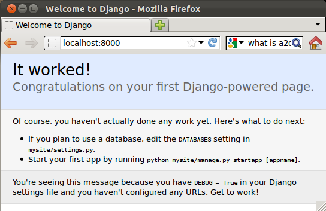

## Logging in

<pre class="code">charlie@WesternSea:~$ mysql -u root -p
Enter password:
Welcome to the MySQL monitor.  Commands end with ; or \g.
Your MySQL connection id is 118
Server version: 5.1.58-1ubuntu1 (Ubuntu)

Copyright (c) 2000, 2010, Oracle and/or its affiliates. All rights reserved.
This software comes with ABSOLUTELY NO WARRANTY. This is free software,
and you are welcome to modify and redistribute it under the GPL v2 license

Type 'help;' or '\h' for help. Type '\c' to clear the current input statement.

mysql>
</pre>

Create a database

<pre class="code">mysql> show databases;
+--------------------+
| Database           |
+--------------------+
| information_schema |
| mysql              |
| phpmyadmin         |
| wordpress          |
+--------------------+
4 rows in set (0.00 sec)

mysql> create database charlie_test

mysql> show databases;
+--------------------+
| Database           |
+--------------------+
| information_schema |
| charlie_test       |
| mysql              |
| phpmyadmin         |
| wordpress          |
+--------------------+
5 rows in set (0.00 sec)
</pre>

## Users

<pre class="code">mysql> use mysql;
Reading table information for completion of table and column names
You can turn off this feature to get a quicker startup with -A

Database changed
mysql> select host, user from user;
+------------+------------------+
| host | user |ex
+------------+------------------+
| 127.0.0.1 | root |
| WesternSea | root |
| localhost | charlie |
| localhost | debian-sys-maint |
| localhost | phpmyadmin |
| localhost | root |
+------------+------------------+
6 rows in set (0.00 sec)

mysql>
</pre>

## Grant

<pre class="code">grant all privileges on script_child to 'charlie'@'localhost' with grant
option;
Query OK, 0 rows affected (0.00 sec)

</pre>

What privileges does he have?

a

<pre> show grants for 'charlie'@'localhost';</pre>

## Change Password

<pre class="code">mysql> use script_child;
Reading table information for completion of table and column names
You can turn off this feature to get a quicker startup with -A

Database changed
mysql> SET PASSWORD for 'charlie'@'%'=PASSWORD('bar');
Query OK, 0 rows affected (0.00 sec)

mysql> SET PASSWORD for 'charlie'@'localhost'=PASSWORD('bar');
Query OK, 0 rows affected (0.00 sec)

mysql> flush privileges;</pre>

## Create Table

<pre>mysql> create table presidents (id int, first varchar(128), last varchar(128));
Query OK, 0 rows affected (0.01 sec)

mysql> show tables;
+------------------------+
| Tables_in_script_child |
+------------------------+
| presidents             |
+------------------------+
1 row in set (0.00 sec)

mysql> alter table presidents add primary key (id);
Query OK, 0 rows affected (0.02 sec)
Records: 0  Duplicates: 0  Warnings: 0
</pre>

Show table structure:

<pre class="code">mysql> describe presidents;
+-------+--------------+------+-----+---------+-------+
| Field | Type         | Null | Key | Default | Extra |
+-------+--------------+------+-----+---------+-------+
| id    | int(11)      | NO   | PRI | 0       |       |
| first | varchar(128) | YES  |     | NULL    |       |
| last  | varchar(128) | YES  |     | NULL    |       |
+-------+--------------+------+-----+---------+-------+
3 rows in set (0.00 sec)
</pre>

## Insert

<pre class="code">mysql> insert into presidents (id, first, last) values (1, 'George', 'Washington');
Query OK, 1 row affected (0.00 sec)

mysql> select * from presidents;
+----+--------+------------+
| id | first  | last       |
+----+--------+------------+
|  1 | George | Washington |
+----+--------+------------+
1 row in set (0.00 sec) o

mysql> insert into presidents (id, first, last) values (2, 'John', 'Adams');
Query OK, 1 row affected (0.00 sec)

mysql> select * from presidents;
+----+--------+------------+
| id | first  | last       |
+----+--------+------------+
|  1 | George | Washington |
|  2 | John   | Adams      |
+----+--------+------------+
2 rows in set (0.00 sec)

mysql>
</pre>

## Django

Download DJango: [https://www.djangoproject.com/download/](https://docs.djangoproject.com/en/dev/intro/tutorial01/)

Learn: [https://docs.djangoproject.com/en/dev/intro/tutorial01/](https://docs.djangoproject.com/en/dev/intro/tutorial01/)

```python
$ tar xzvf Django-1.3.1.tar.gz
$ cd Django-1.3.1/
$ sudo python setup.py install

python -c "from distutils.sysconfig import get_python_lib; print get_python_lib()"
/usr/lib/python2.7/dist-packages
</pre>

<pre class="code">charlie@WesternSea:~/Downloads/Django-1.3.1$ python
Python 2.7.2+ (default, Oct  4 2011, 20:03:08)
[GCC 4.6.1] on linux2
Type "help", "copyright", "credits" or "license" for more information.
>>> import django
>>> pring django.get_version()
  File "<stdin>", line 1
    pring django.get_version()
               ^
SyntaxError: invalid syntax
>>> print django.get_version()
1.3.1
>>>
```

## Set up a web site

<pre>mkdir Source
cd Source
python manage.py runserver
Validating models...

0 errors found
Django version 1.3.1, using settings 'mysite.settings'
Development server is running at http://127.0.0.1:8000/
Quit the server with CONTROL-C.
[29/Jan/2012 00:58:21] "GET / HTTP/1.1" 200 2051
</pre>

Okay, your site is set up, and a toy webserver is running.

Go to [http://localhost:8000/](http://localhost:8000/)



<pre class="code">sudo apt-get install python-mysqldb
python manage.py syncdb</pre>

Or this:

```sql
charlie@WesternSea:~/Source/mysite$ python manage.py sql polls
BEGIN;
CREATE TABLE `polls_poll` (
    `id` integer AUTO_INCREMENT NOT NULL PRIMARY KEY,
    `question` varchar(200) NOT NULL,
    `pub_date` datetime NOT NULL
)
;
CREATE TABLE `polls_choice` (
    `id` integer AUTO_INCREMENT NOT NULL PRIMARY KEY,
    `poll_id` integer NOT NULL,
    `choice` varchar(200) NOT NULL,
    `votes` integer NOT NULL
)
;
ALTER TABLE `polls_choice` ADD CONSTRAINT `poll_id_refs_id_5d896c23` FOREIGN KEY (`poll_id`) REFERENCES `polls_poll` (`id`);
COMMIT;
charlie@WesternSea:~/Source/mysite$ python manage.py syncdb
Creating tables ...
Creating table polls_poll
Creating table polls_choice
Installing custom SQL ...
Installing indexes ...
No fixtures found.
charlie@WesternSea:~/Source/mysite$ python manage.py shell
Python 2.7.2+ (default, Oct  4 2011, 20:03:08)
[GCC 4.6.1] on linux2
Type "help", "copyright", "credits" or "license" for more information.
(InteractiveConsole)
>>> from polls.models import Poll, Choice
>>> Poll.objects.all()
[]
>>> import datetime
>>> p = Poll(question="What's up?", pub_date=datetime.datetime.now())
>>> p.save()
>>> p.id
1L
>>> p.question
"What's up?"
>>> p.pub_date
datetime.datetime(2012, 1, 29, 1, 57, 57, 496429)
>>> Poll.objects.all()
[<poll: poll="" object="">]
>>></poll:>
```

http://localhost:8000/admin/

## PHP

Here is your script, which you can place anywhere:

<pre class="code"><html>
<body>
<?php
print "<h1>Ahoy</h1>";

$con = mysql_connect("localhost","charlie","xxx");
if (!$con)
{
die('Could not connect: ' . mysql_error());
}

$db_selected = mysql_select_db("script_child", $con);
if (!$db_selected) {
die ('Can\'t use database : ' . mysql_error());
}

$result = mysql_query("SELECT * FROM presidents");

// Check result
// This shows the actual query sent to MySQL, and the error. Useful for debugging.
if (!$result) {
$message = 'Invalid query: ' . mysql_error() . "\n";
die($message);
}

while($row = mysql_fetch_array($result))
{
echo $row['first'] . " " . $row['last'];
echo "<br />";
}

mysql_close($con);
?>
</body>
</html></pre>

## Python

First write your script

```python
#!/usr/bin/python
import MySQLdb;
import cgi

print "Content-Type: text/html\n\n"
print
print "<html>\n"
print "<head>\n"
print "<meta content='text/html; charset=utf-8' http-equiv='Content-Type'>\n"
print "\t<title>Info Form</title>\n"
print "</head>\n"
print "<body BGCOLOR = white>\n"
db = MySQLdb.connect(host="localhost", port=80, user="charlie", passwd="xxx", db="script_child")
cursor = db.cursor()
cursor.execute("SELECT first, last FROM presidents")
rows = cursor.fetchall()
for row in rows:
print "<p>%s, %s</p>" % (row[0], row[1])
print "</body>\n"
print "</html>\n"
```

If you want, read /etc/apahce2/sistes-available/default. In there you will find:

<pre class="code">    ScriptAlias /cgi-bin/ /usr/lib/cgi-bin/
	<Directory "/usr/lib/cgi-bin">
		AllowOverride None
		Options +ExecCGI -MultiViews +SymLinksIfOwnerMatch
		Order allow,deny
		Allow from all
	</Directory>
</pre>

Now you know where to put your script. Be sure to make it executable:

<pre class="code">sudo chmod +x data_python.py</pre>
